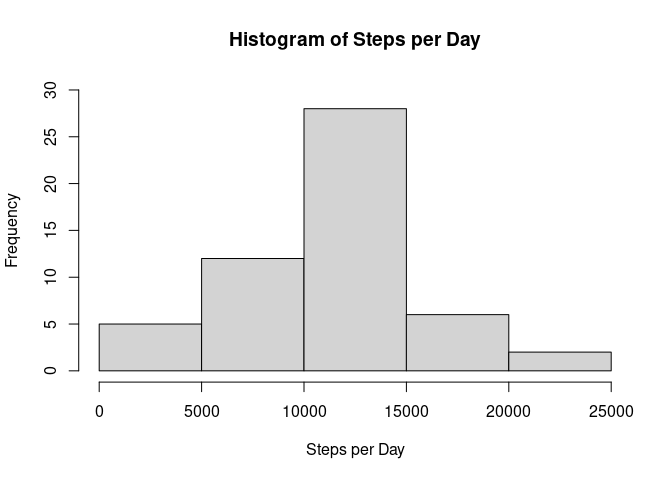
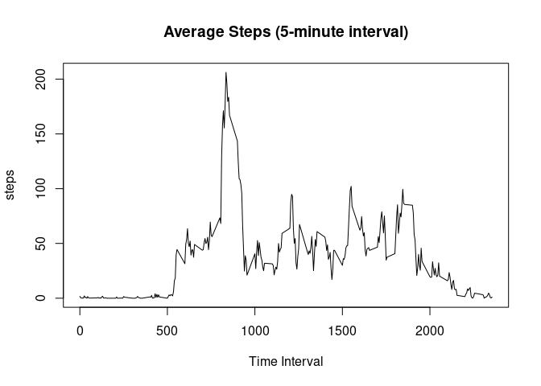
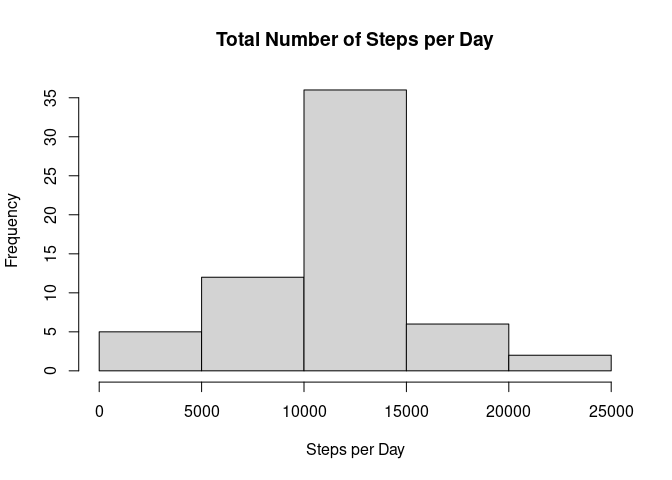
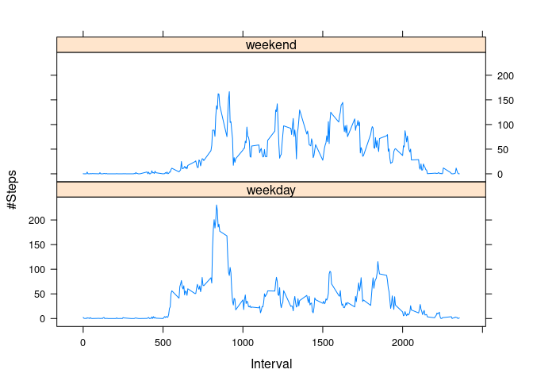

# Introduction

This is the first assignment of Reproducible Research. The data is the personal movement using activity monitoring devices. This device collects data at 5 minute intervals through out the day. The date consists of two months of data from an anonymous individual collected during the months of October and November, 2012 and include the number of steps taken in 5 minute intervals each day. 

Firstly, I will explore the total number of steps and the average for 5-minute interval without imputing data for the missing values. Secondly, I will use the mean for 5-minute interval to impute the missing date, and redo the analysis of total number and the mean for the interval. 

First, get data downloaded. The link is copied from the Coursera project website. 

```
## [1] TRUE
```
## Load data & Process the Data

## What is mean total number of steps taken per day?

```r
activity <- read.csv(file ="activity.csv", header = TRUE)
step_day <- aggregate(steps ~ date, activity, sum, na.rm = TRUE)
step_day$date <- as.Date(strptime(step_day$date, format = "%Y-%m-%d"))
hist(step_day$steps, ylim = c(0,30),
     xlab = "Steps per Day", ylab = "Frequency",
     main  = "Histogram of Steps per Day")
```

<!-- -->

```r
dev.copy(png, "hist1.png")
```

```
## png 
##   3
```

```r
dev.off()
```

```
## png 
##   2
```

```r
summary(step_day$steps)
```

```
##    Min. 1st Qu.  Median    Mean 3rd Qu.    Max. 
##      41    8841   10765   10766   13294   21194
```
The mean of total steps per day is 10766 and the median is 10765. 

## What is the average daily activity pattern?
1. Make a time series plot of the 5-minute interval (x-axis) and the average number of steps taken, averaged across all days (y-axis)?

```r
step_inter <- aggregate(steps ~ interval, activity, mean, na.rm = TRUE)
plot(steps ~ interval, step_inter, type = "l", xlab = "Time Interval", 
     main = "Average Steps (5-minute interval)")
```

<!-- -->

```r
dev.copy(png, "plot1.png")
```

```
## png 
##   3
```

```r
dev.off()
```

```
## png 
##   2
```
2. Which 5-minute interval, on average across all the days in the dateset, contains the maximum of steps?

```r
step_inter[which.max(step_inter$steps),]$interval
```

```
## [1] 835
```
The 835th 5-minute interval contains the maximum of steps on average. 
## Imputing missing values
1. Calculate and report the total number of missing values in the dataset (i.e. the total number of rows with NAs)

```r
sum(is.na(activity$steps))
```

```
## [1] 2304
```
There are 2304 missing values in the original dataset.

2. Devise a strategy for filling in all of the missing values in the dataset. The strategy does not need to be sophisticated. For example, you could use the mean/median for that day, or the mean for that 5-minute interval, etc. Then, let's use the simplest strategy, which is imputing data by the mean for that 5-minute interval. 

I will fill in the missing values in the original dataset with the mean per interval. First, write a function to get mean per interval using non-missing data. 

3. Create a new dataset that is equal to the original dataset but with the missing data filled in. 

```r
getMean<-function(interval){
  step_inter[step_inter$interval==interval,]$steps
}

activity_impute <- activity
for(i in 1:nrow(activity_impute)) {
  if(is.na(activity_impute[i,]$steps)){
     activity_impute[i,]$steps <- getMean(activity_impute[i,]$interval)
  }
}
```
4. Make a histogram of the total number of steps taken each day and Calculate and report the **mean** and **median** total number of steps taken per day. Do these values differ from the estimates from the first part of the assignment? What is the impact of imputing missin gdata on the estimates of the total daily number of steps?

```r
activity_day_impute <- aggregate(steps ~ date, activity_impute, sum)
hist(activity_day_impute$steps, xlab = "Steps per Day", ylab = "Frequency",
     main = "Total Number of Steps per Day")
```

<!-- -->

```r
dev.copy(png, "hist2.png")
```

```
## png 
##   3
```

```r
dev.off()
```

```
## png 
##   2
```

```r
summary(activity_day_impute$steps)
```

```
##    Min. 1st Qu.  Median    Mean 3rd Qu.    Max. 
##      41    9819   10766   10766   12811   21194
```
The mean did not change after imputing the missing values, and median have a subtle change from 10765 to 10766. 

## Are there differences in activity patterns between weekdays and weekends?
1. Create a new factor variable in the dataset with two levels - "weekday" and "weekend" indicating whether a given date is weekday or weekend day. 

```r
activity_impute$date <- as.Date(strptime(activity_impute$date, format = "%Y-%m-%d"))
activity_impute$day <- weekdays(activity_impute$date)
for (i in 1:nrow(activity_impute)){
  if (activity_impute[i,]$day %in% c("Saturday","Sunday")) {
    activity_impute[i,]$day <- "weekend"
  } else {
    activity_impute[i,]$day <- "weekday"
  }
}

step_inter_impute <- aggregate(steps ~ interval + day , activity_impute, mean)
```
2. Make a panel plot containing a time series plot (type = "l") of the 5-minute interval and the average number of steps taken, averaged across all weekday days or weekend days.

```r
library(lattice)
xyplot(steps ~ interval | day, step_inter_impute, type = "l",
       layout=c(1,2), xlab = "Interval", ylab = "#Steps")
```

<!-- -->

```r
dev.copy(png, "plot2.png")
```

```
## png 
##   3
```

```r
dev.off()
```

```
## png 
##   2
```


